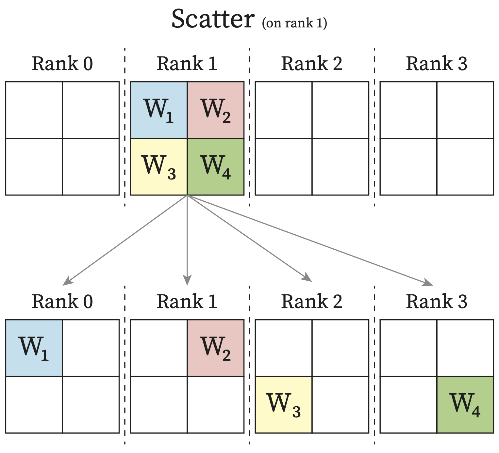
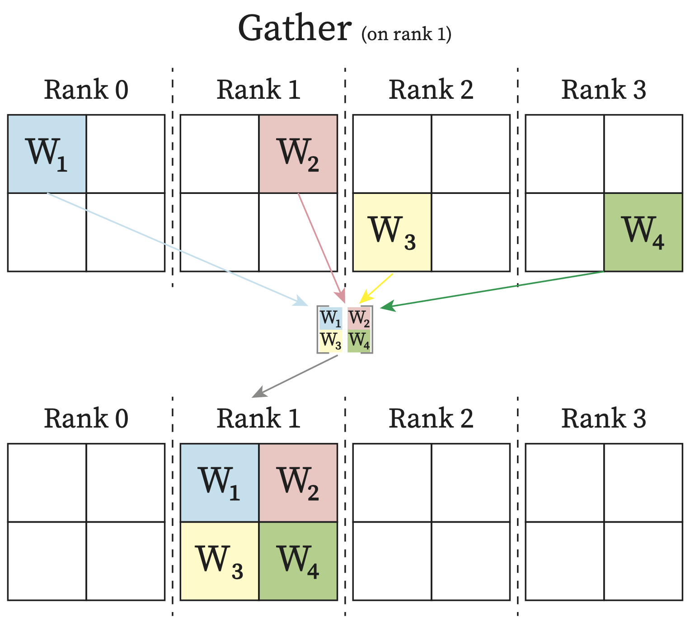
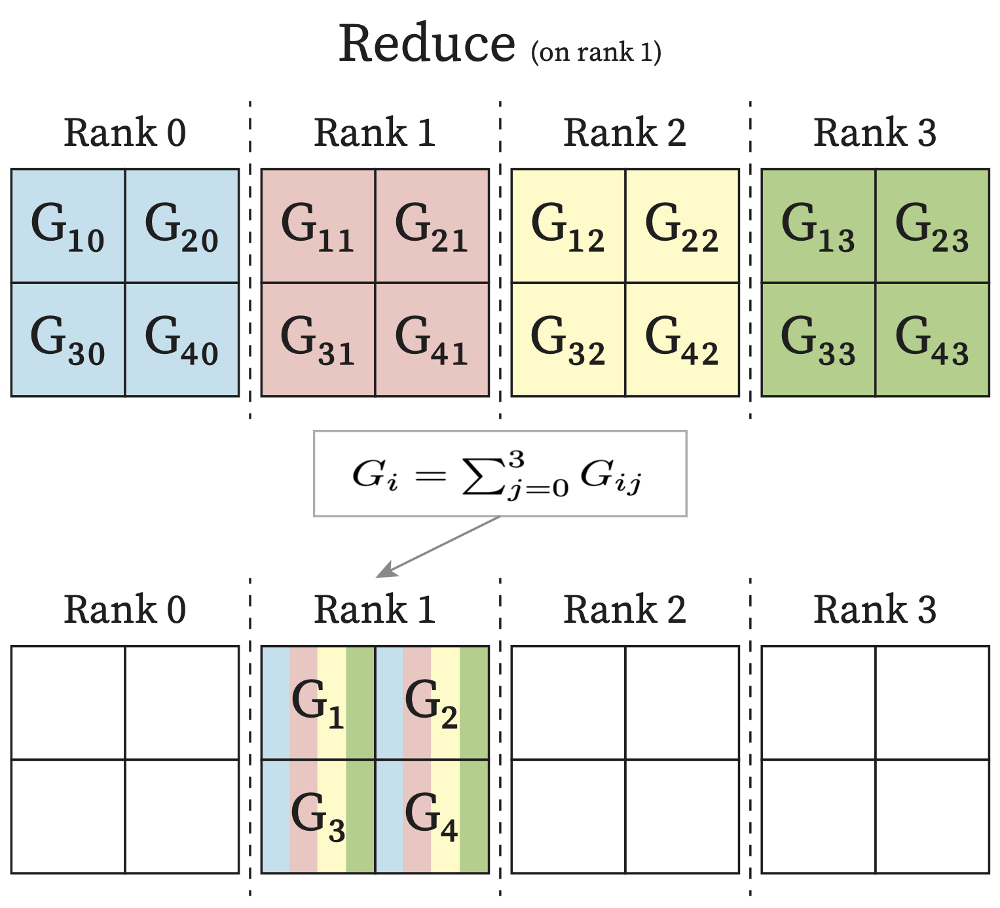
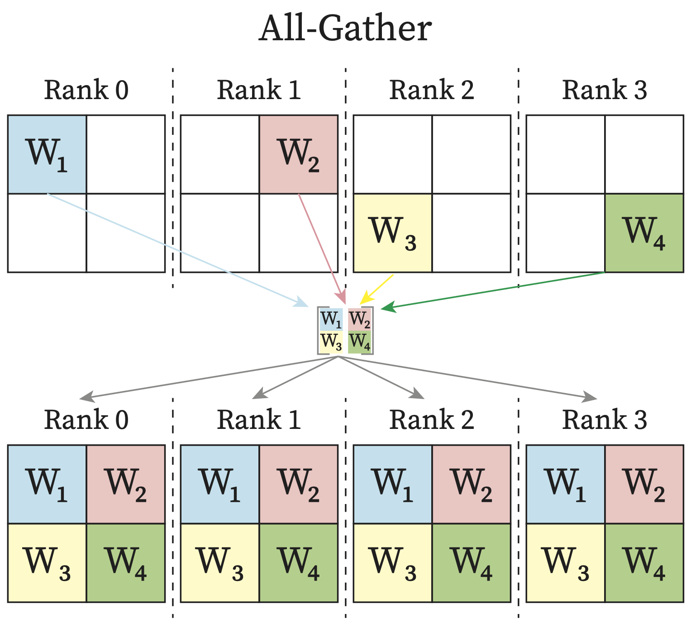
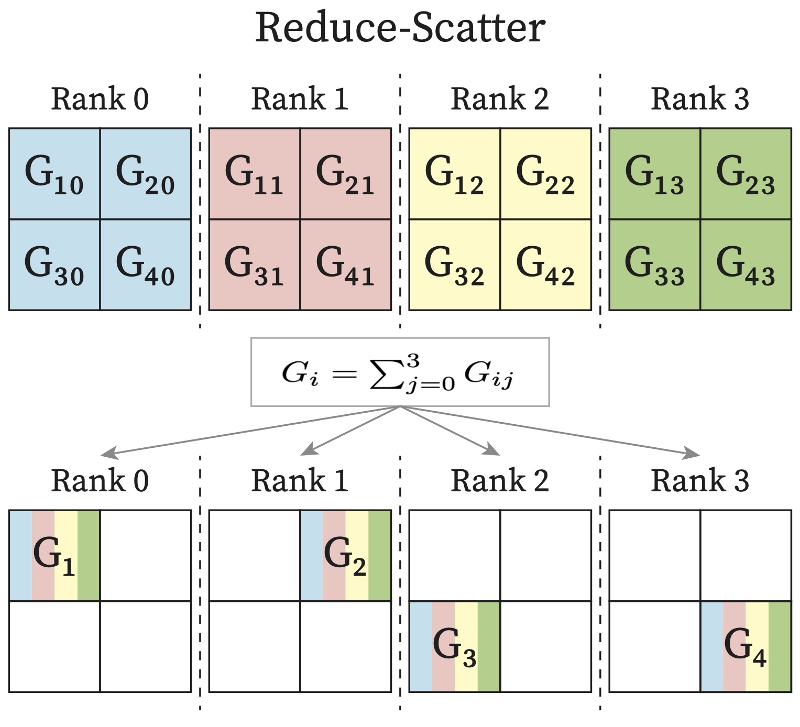
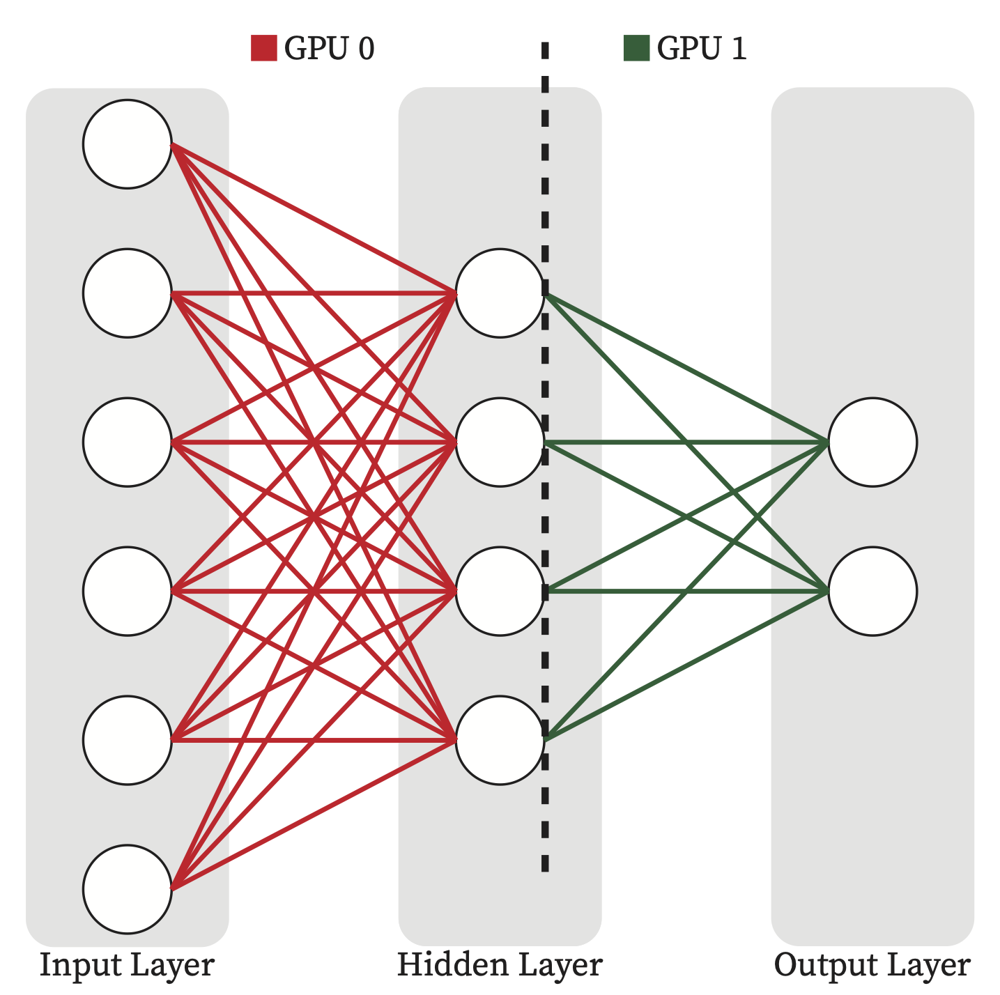
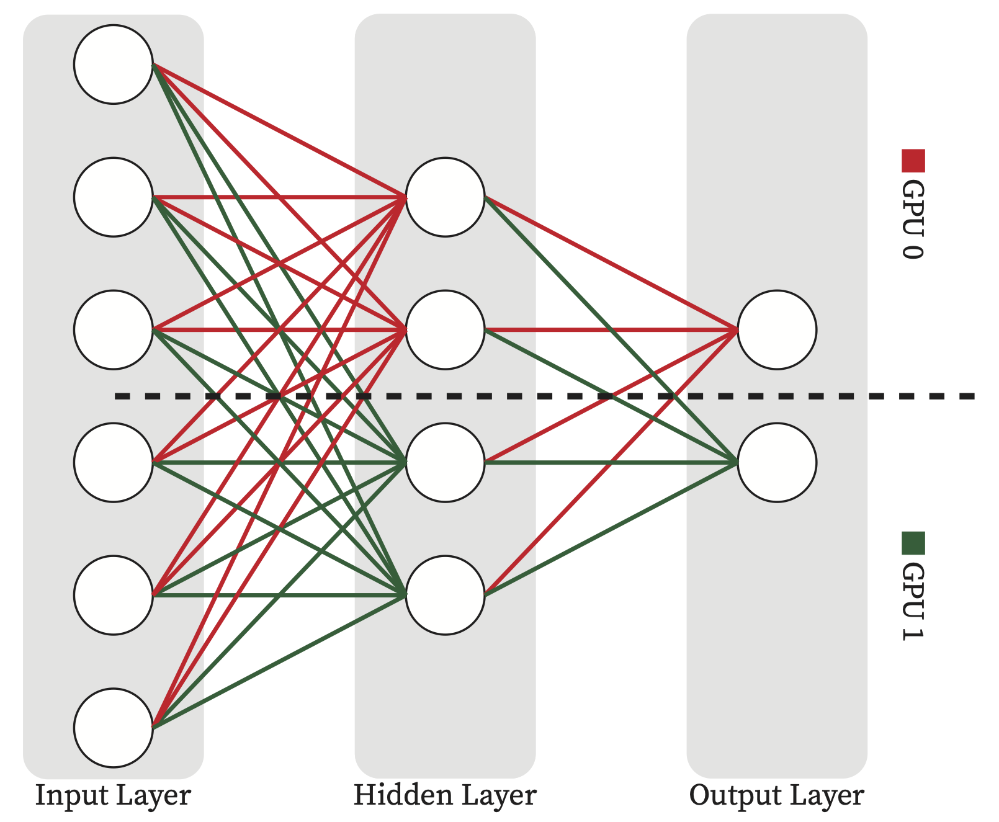

# Distributed GPU Computing
The scaling of machine learning (ML) workloads in HPC environments can be achieved through various parallelism approaches. This section outlines the primary methods for parallelizing ML computations.

One can decide to use multiple GPUs on their AI/ML applications for different reasons including but not limited to:
* Handling large-scale datasets
* Hyperparameter tuning
* Train/inferece large-scale Model that does not fit into the memory of a single GPU. 

## Inter GPU Communication
In majority of use-cases of multi-GPU computation there is the need for different GPU to communicate and send their partail computation to one another to sync. NCCL libarary from NVIDIA is widely in use for NIVIDA based GPU communication.
(sec-nccl)=
### NVIDIA Collective Communication Library (NCCL)
For multi-GPU and multi-node communication, NVIDIA Collective Communication Library (NCCL, pronounced “Nickel”) is being used as backend in distributed strategies for Nvidia GPUs such as Distributed Data Parallel (DDP) and Fully Sharded Data Parallel (FSDP). Following are some of the most related NCCL collective communication primitives :
* Scatter: From one rank, data will be distributed across all rank, with each rank receiving a subpart of the data.
* Gather: One rank will receive the aggregation of data from all ranks.
* AllGather: Each rank receives the aggregation of data from all ranks in the order of the ranks.
* Reduce: One rank receives the reduction of input values across ranks.
* AllReduce: Each rank receives the reduction of input values across ranks.
* ReduceScatter: Input values are reduced across ranks, with each rank receiving a subpart of the result.
```{seealso}
For more information about the different NCCL collective operations refer to:
https://docs.nvidia.com/deeplearning/nccl/user-guide/docs/usage/collectives.html
``` 
```{note}
Each process in the multi-process applications is called a rank. Usually each process has its own exclusive device. Therefore you can think of each rank as one GPU in the following diagrams.
```

````{list-table} Inter-GPU Collective Communication Primitives.
:header-rows: 0

* - 
   - 
* - 
   - 
* - 
   - 
````
## Distributed Training Strategies
### Simple MLP Network
To go over the different distributed computing strategies that have been used widely in AI/ML community, let's consider the following simple example.
```{figure} figures/png/mlp_network.png
---
width: 50%
name: mlp_network
---
A 2-Layer MLP Network.
```
{numref}`mlp_matrices` shows the input, output of the above network as well as the weight and bias tensors of each layer in {numref}`mlp_network`
```{figure} figures/png/mlp_matrices.png
---
width: 80%
name: mlp_matrices
---
Input, output, weight and bias matrices of the mlp model in {numref}`mlp_network`.
```
* Forward Pass Computations
```{math}
:name: forward_computation
h = xW_1 + b_1

y' = hW_2 + b_2
```
* Loss Calculation
```{math}
:name: loss_computation
L = \frac{1}{2} (y' - y)^2
```
* Backward Pass Computations
```{math}
:name: backward_computation_dy
\frac{dL}{dy'} = y' - y
```
```{math}
:name: backward_computation_layer2
&W_2.grad = \frac{dL}{dW_2} = \frac{dL}{dy'} . \frac{dy'}{dW_2} = (y' - y) . h^T \\
&b_2.grad = \frac{dL}{db_2} = \frac{dL}{dy'} . \frac{dy'}{db_2} = (y' - y)
```
```{math}
:name: backward_computation_dh
\frac{dL}{dh} = \frac{dL}{dy'} . \frac{dy'}{dh} = (y' - y) . W_2
```
```{math}
:name: backward_computation_layer1
&W_1.grad = \frac{dL}{dW_1} = \frac{dL}{dh} . \frac{dh}{dW_1} = [(y' - y) . W_2] . x^T \\
&b_1.grad = \frac{dL}{db_1} = \frac{dL}{dh} . \frac{dh}{db_1} = [(y' - y) . W_2] 
```
* Updating the Model
```{math}
:name: update_computation
&W_i = W_i - \alpha . W_i.grad \\
&b_i = b_i - \alpha . b_i.grad 
```
Corresponding single-GPU pytorch code for the above example would be the following code:
```{code-block}
:name: mlp_single_gpu
:caption: mlp_single_gpu.py - Simple MLP example training loop. Note that it uses a random dataset with size of 1024 and batch size of 32.
import torch
import torch.nn as nn
import torch.optim as optim
from torch.utils.data import DataLoader
from random_dataset import RandomTensorDataset

class MLP(nn.Module):
  def __init__(self, in_feature, hidden_units, out_feature):
    super().__init__()

    self.hidden_layer = nn.Linear(in_feature, hidden_units)
    self.output_layer = nn.Linear(hidden_units, out_feature)
  
  def forward(self, x):
    x = self.hidden_layer(x)
    x = self.output_layer(x)
    return x

device = 0 # Using single GPU (GPU 0)

# model construction
layer_1_units = 6
layer_2_units = 4
layer_3_units = 2
model = MLP(
  in_feature=layer_1_units,
  hidden_units=layer_2_units,
  out_feature=layer_3_units
  ).to(device)

loss_fn = nn.MSELoss()
optimizer = optim.SGD(model.parameters(),lr=0.01)

# dataset construction
num_samples = 1024
batch_size  = 32
dataset = RandomTensorDataset(
  num_samples=num_samples,
  in_shape=layer_1_units,
  out_shape=layer_3_units
  )

dataloader = DataLoader(
  dataset,
  batch_size=batch_size,
  pin_memory=True,
  shuffle=True
  )

max_epochs = 1
for i in range(max_epochs):
  print(f"[GPU{device}] Epoch {i} | Batchsize: {len(next(iter(dataloader))[0])} | Steps: {len(dataloader)}")
  for x, y in dataloader:
    x = x.to(device)
    y = y.to(device)
    
    # Forward Pass 
    out = model(x)

    # Calculate loss
    loss = loss_fn(out, y)

    # Zero grad
    optimizer.zero_grad(set_to_none=True)

    # Backward Pass
    loss.backward()

    # Update Model
    optimizer.step()
```
The `RandomTensorDataset` will generate random tensors for the input as well as output label.
```{code-block}
:name: random_dataset
:caption: random_dataset.py - Simple Random Dataset
import torch
from torch.utils.data import Dataset

class RandomTensorDataset(Dataset):
  def __init__(self, num_samples, in_shape, out_shape):
    self.num_samples = num_samples
    torch.manual_seed(12345)
    self.data = [(torch.randn(in_shape), torch.randn(out_shape)) for _ in range(num_samples)]
  
  def __len__(self):
    return self.num_samples

  def __getitem__(self, idx):
    return self.data[idx]
```
````{dropdown} Run the above code on the HPC cluster
If you don't have a conda environment already in which PyTorch is installed, you need to create one.

```{code-block} bash
:name: conda_setup
:caption: Conda Environment Setup
# Creating the conda envireonment named `dist_computing` (one can use their own customized name).
conda create -n dist_computing python=3.10

# Activating the conda environment and install PyTorch:
conda activate dist_computing
pip3 install torch
```
The conda environment activation needs also be added to the slurm scripts.

Now create `mlp_single_gpu.py` and `random_dataset.py` from {numref}`mlp_single_gpu` and {numref}`random_dataset` respectively and use the following slurm script to run it on the HPC cluster.
```{code-block} bash
:name: single_gpu_slurm
:caption: Slurm script skeleton to run the single-GPU mlp example.
#! /bin/bash
#SBATCH --job-name=mlp-single-gpu
#SBATCH --output=mlp.out
#SBATCH --error=mlp.err
#SBATCH --time=00:10:00
#SBATCH --partition=kempner
#SBATCH --nodes=1
#SBATCH --ntasks-per-node=1
#SBATCH --cpus-per-task=4
#SBATCH --mem=64G
#SBATCH --account=kempner_dev # Add your own account here
#SBATCH --gres=gpu:1

module load python
conda activate dist_computing

python mlp_single_gpu.py
```
````
### Distributed Data Parallelism (DDP)
Distributed Data Parallelism facilitates training a model on high-volume datasets by distributing the computation across multiple devices. It involves splitting the dataset into smaller batches that are processed in parallel across different GPUs. Each GPU trains a copy of the model on its subset of the data, and the results are aggregated to update the model.

Particularly, in each training step, GPUs perform forward and backward passes locally and compute the parameter gradients corresponding to their current data batch. Then before updating the model weights, GPUs communicate to sum the parameter gradients across GPUs. This guarantees the model replicas being kept consistent across GPUs before starting the next training step. This inter-GPU communication are optimized by All-Reduce collective communication primitive from NCCL library for Nvidia GPUs, see {numref}`sec-nccl`.

{numref}`ddp` shows a high-level overview of how DDP works. 
```{figure} figures/png/DDP.png
---
height: 500px
name: ddp
---
Schematic Diagram of DDP Computation, Communication and Their Potential Overlapp.
```
```{note}
The limitation is that DDP requires all model parameters, gradients, and optimizer states to fit into the memory of a single GPU device.
```

Now let's see how DDP applies on the above simple MLP example in {numref}`mlp_single_gpu`.
```{figure} figures/png/mlp_ddp.png
---
width: 100%
name: mlp_ddp_figure
---
DDP for the simple MLP example. For simplicity it does not show communication overlap.
```
{numref}`mlp_ddp_figure` shows that each GPU take a copy of the model, both has the whole $W_1$, $b_1$, $W_2$ and $b_2$. It shows the dataset is divided into two parts and each GPU sees only its own batches of the data perform the forward and backward passes locally. After each backward pass and before updating model, the GPUs needs to sync on gradients since each GPU compute their own gradiens for the model parameters based on the data batches that they process. The average of the parameter garaients across the GPUs are computed and synced across all GPUs using All-Reduce commpunication primitive, see {numref}`sec-nccl`. it guarantees the model on all GPUs are consistent before starting the next iteration.

Next, we can take the single-GPU code of our simple mlp example from {numref}`mlp_single_gpu` and modify to use two GPUs using DDP.
````{dropdown} Using DDP To Run The Simple MLP Example On Two GPUs
```{code-block}
:name: mlp_ddp_code
:caption: mlp_ddp.py - Modifying the simple mlp example, {numref}`mlp_single_gpu`, to run on multiple GPUs using DDP
import torch
import torch.nn as nn
import torch.optim as optim
from torch.utils.data import DataLoader

from torch.utils.data.distributed import DistributedSampler
from torch.nn.parallel import DistributedDataParallel as DDP
from torch.distributed import init_process_group, destroy_process_group, is_initialized
import os
from socket import gethostname

from random_dataset import RandomTensorDataset

class MLP(nn.Module):
  def __init__(self, in_feature, hidden_units, out_feature):
    super().__init__()

    self.hidden_layer = nn.Linear(in_feature, hidden_units)
    self.output_layer = nn.Linear(hidden_units, out_feature)
  
  def forward(self, x):
    x = self.hidden_layer(x)
    x = self.output_layer(x)
    return x

rank          = int(os.environ["SLURM_PROCID"])
world_size    = int(os.environ["WORLD_SIZE"])
gpus_per_node = int(os.environ["SLURM_GPUS_ON_NODE"])

assert (
  gpus_per_node == torch.cuda.device_count()
), f'SLURM_GPUS_ON_NODE={gpus_per_node} vs torch.cuda.device_count={torch.cuda.device_count()}'

print(
  f"Hello from rank {rank} of {world_size} on {gethostname()} where there are" \
  f" {gpus_per_node} allocated GPUs per node." \
  f" | (CUDA_VISIBLE_DEVICES={os.environ["CUDA_VISIBLE_DEVICES"]})", flush=True
)

# Using NCCl for inter-GPU communication
init_process_group(backend="nccl", rank=rank, world_size=world_size)
if rank == 0: print(f"Group initialized? {is_initialized()}", flush=True)

device = rank - gpus_per_node * (rank // gpus_per_node)
torch.cuda.set_device(device)

print(f'Using GPU{device} on Machine {os.uname().nodename.split('.')[0]} (Rank {rank})')

# model construction
layer_1_units = 6
layer_2_units = 4
layer_3_units = 2
model = MLP(
  in_feature=layer_1_units,
  hidden_units=layer_2_units,
  out_feature=layer_3_units
  ).to(device)

model = DDP(model, device_ids=[device])

loss_fn = nn.MSELoss()
optimizer = optim.SGD(model.parameters(),lr=0.01)

# dataset construction
num_samples = 1024
batch_size  = 32
dataset = RandomTensorDataset(
  num_samples=num_samples,
  in_shape=layer_1_units,
  out_shape=layer_3_units
  )

dataloader = DataLoader(
  dataset,
  batch_size=batch_size, # Global batch size is equal to batch_size multiply by the number of GPUs (world_size). batch_size=(batch_size//worldsize) to maintain the global batch size as batch_size
  pin_memory=True,
  shuffle=False,
  num_workers=int(os.environ["SLURM_CPUS_PER_TASK"]),
  sampler=DistributedSampler(dataset, num_replicas=world_size, rank=rank)
  )

max_epochs = 1
for i in range(max_epochs):
  print(f"[GPU{rank}] Epoch {i} | Batchsize: {len(next(iter(dataloader))[0])} | Steps: {len(dataloader)}")
  dataloader.sampler.set_epoch(i)
  for x, y in dataloader:
    x = x.to(device)
    y = y.to(device)
    
    # Forward Pass 
    out = model(x)

    # Calculate loss
    loss = loss_fn(out, y)

    # Zero grad
    optimizer.zero_grad(set_to_none=True)

    # Backward Pass
    loss.backward()

    # Update Model
    optimizer.step()

destroy_process_group()
```
To run this code we need the `random_sataset.py` from {numref}`random_dataset` and a conda environment in which PyTorch is installed, refer to {numref}`conda_setup` to create one if you don't have one already.

Now use the following slurm script skeleton to run the `mlp_ddp.py` from {numref}`mlp_ddp_code`. Note that we need to add environment variables to specify the Master node info, rank, local rank, etc.
```{code-block} bash
:name: multi_gpu_slurm
:caption: Slurm script skeleton to run {numref}`mlp_ddp_code` on multiple GPUs. Here, it requests for two nodes, one GPU on each node, a total of two GPUs.
#! /bin/bash
#SBATCH --job-name=mlp_tp
#SBATCH --output=tp.out
#SBATCH --error=tp.err

#SBATCH --nodes=2
#SBATCH --ntasks-per-node=1
#SBATCH --cpus-per-task=4
#SBATCH --gpus-per-node=1

#SBATCH --time=00:10:00
#SBATCH --mem=64G
#SBATCH --partition=kempner
#SBATCH --account=kempner_dev

module load python cuda cudnn
conda activate dist_computing

export MASTER_ADDR=$(scontrol show hostnames | head -n 1)
export MASTER_PORT=39591
export RANK=$SLURM_PROCID
export LOCAL_RANK=$SLURM_LOCALID
export WORLD_SIZE=$(($SLURM_NNODES * $SLURM_NTASKS_PER_NODE))

srun --ntasks-per-node=$SLURM_NTASKS_PER_NODE \
     python -u mlp_ddp.py
```
````
### Model Parallelism (MP)
Although DDP can significantly accelerate the training process, it does not work for some use cases where the model is too large to fit into a single GPU. Unlike DDP, Model Parallelism focuses on parallelizing the model itself, rather than the data to support training the larger models.

A naive implementation could be dividing the model vertically meaning that the layers of the model are divided into multiple groups consisting of one or more layers. Each GPU will hold one group. The forward and backward phase will be performed sequentially.

{numref}`mlp_mp_figure` shows the model parallelism of our simple mlp example.
```{figure} figures/png/mlp_mp.png
---
width: 100%
name: mlp_mp_figure
---
Model Parallelism for the simple MLP example. Note since the output of one GPU is used as input of the next one, it results in a high GPU idle time.
```
````{dropdown} Using MP To Run The Simple MLP Example On Two GPUs
{numref}`mlp_mp_code` shows how to send each layer into different GPUs using `.to` method from `torch` module while defining different layers of the model. Note that the input data (`x`) should also be sent to proper devices accordingly in the forward function. 
```{code-block}
:name: mlp_mp_code
:caption: mlp_model_parallel.py - Modifying the simple mlp example, {numref}`mlp_single_gpu`, to run on two GPUs on the same node using MP

import torch
import torch.nn as nn
import torch.optim as optim
from torch.utils.data import DataLoader
from random_dataset import RandomTensorDataset

class MLP(nn.Module):
  def __init__(self, in_feature, hidden_units, out_feature):
    super().__init__()

    self.hidden_layer = nn.Linear(in_feature, hidden_units).to(0)
    self.output_layer = nn.Linear(hidden_units, out_feature).to(1)
  
  def forward(self, x):
    x = self.hidden_layer(x.to(0))
    x = self.output_layer(x.to(1))
    return x

# model construction
layer_1_units = 6
layer_2_units = 4
layer_3_units = 2
model = MLP(
  in_feature=layer_1_units,
  hidden_units=layer_2_units,
  out_feature=layer_3_units
)

loss_fn = nn.MSELoss()
optimizer = optim.SGD(model.parameters(),lr=0.01)

# dataset construction
num_samples = 1024
batch_size=32
dataset = RandomTensorDataset(
  num_samples=num_samples,
  in_shape=layer_1_units,
  out_shape=layer_3_units
  )

dataloader = DataLoader(
  dataset,
  batch_size=batch_size,
  pin_memory=True,
  shuffle=True
  )

max_epochs = 1
for i in range(max_epochs):
  print(f"Epoch {i} | Batchsize: {len(next(iter(dataloader))[0])} | Steps: {len(dataloader)}")
  for x, y in dataloader:
    y = y.to(1)
    
    # Forward Pass 
    out = model(x)

    # Calculate loss
    loss = loss_fn(out, y)

    # Zero grad
    optimizer.zero_grad(set_to_none=True)

    # Backward Pass
    loss.backward()

    # Update Model
    optimizer.step()
```
To run it you can just follow the same steps when running the single GPU {numref}`mlp_single_gpu`. Note that it requires two available GPUs on the same node.
````
As you see in {numref}`mlp_mp_figure`, the main drawback of this method is that at any given time only one of the GPUs are active and the other GPUs are idle leading to underutilization of the compute resources. Tensor Parallelism (sharding model horizontally) and Pipeline Parallelism are other forms of Model parallelism that aim to mitigate this drawback.


````{list-table} Model Partitioned Into Two GPUs Using Pipeline Parallelism (left) vs Tensor Prallelism (right).
:header-rows: 0
* - 
  - 
````

### Pipeline Parallelism (PP)
It is very similar to the naive model parallelism while it combines aspects of data and model parallelism by splitting the model into stages that are processed in a pipeline fashion to mitigate the GPU idle time issue in model prallelism. Each stage of the model is processed on different GPU, allowing for efficient parallel processing of large models and datasets.

### Tensor Parallelism (TP)
Tensor Parallelism is a form of Model Parallelism in which we divide the parameter tensors of each layer into slices and each GPU will hold one slice instead of putting the entire layer in one GPU. In this way each GPU participates in computation of every layer equally and does not have to be idle and waiting for other GPUs to perform previous layers’ computation.

{numref}`mlp_tp_figure` shows the model parallelism of our simple mlp example.
```{figure} figures/png/mlp_tp.png
---
width: 100%
name: mlp_tp_figure
---
Tensor Parallelism for the simple MLP example. In this example each tensor is divided into two slices column-wise. Each GPU computing a part of the output and then communication needed to gather the partail compuation across GPUs.
```

````{dropdown} Using TP To Run The Simple MLP Example On Two GPUs 
```{code-block}
:name: mlp_tp_code
:caption: mlp_tensor_parallel.py - Modifying the simple mlp example, {numref}`mlp_single_gpu`, to run on multiple GPUs using TP
import torch
import torch.nn as nn
import torch.optim as optim
from torch.utils.data import DataLoader

from torch.distributed.tensor.parallel import (
  parallelize_module,
  ColwiseParallel,
  RowwiseParallel,
)
from torch.distributed._tensor.device_mesh import init_device_mesh
from torch.distributed import init_process_group, destroy_process_group, is_initialized
import os
from socket import gethostname

from random_dataset import RandomTensorDataset

class MLP(nn.Module):
  def __init__(self, in_feature, hidden_units, out_feature):
    super().__init__()

    self.hidden_layer = nn.Linear(in_feature, hidden_units)
    self.output_layer = nn.Linear(hidden_units, out_feature)
  
  def forward(self, x):
    x = self.hidden_layer(x)
    x = self.output_layer(x)
    return x

rank          = int(os.environ["SLURM_PROCID"])
world_size    = int(os.environ["WORLD_SIZE"])
gpus_per_node = int(os.environ["SLURM_GPUS_ON_NODE"])

assert (
  gpus_per_node == torch.cuda.device_count()
), f'SLURM_GPUS_ON_NODE={gpus_per_node} vs torch.cuda.device_count={torch.cuda.device_count()}'

print(
  f"Hello from rank {rank} of {world_size} on {gethostname()} where there are" \
  f" {gpus_per_node} allocated GPUs per node." \
  f" | (CUDA_VISIBLE_DEVICES={os.environ["CUDA_VISIBLE_DEVICES"]})", flush=True
)

# Using NCCl for inter-GPU communication
init_process_group(backend="nccl", rank=rank, world_size=world_size)
if rank == 0: print(f"Group initialized? {is_initialized()}", flush=True)

device_mesh = init_device_mesh(device_type="cuda", mesh_shape=(world_size,))
assert(rank == device_mesh.get_rank())
device = rank - gpus_per_node * (rank // gpus_per_node)
torch.cuda.set_device(device)

print(f'Using GPU{device} on Machine {os.uname().nodename.split('.')[0]} (Rank {rank})')

# model construction
layer_1_units = 6
layer_2_units = 4
layer_3_units = 2
model = MLP(
  in_feature=layer_1_units,
  hidden_units=layer_2_units,
  out_feature=layer_3_units
  ).to(device)

model = parallelize_module(
  module=model,
  device_mesh=device_mesh,
  parallelize_plan={
    "hidden_layer": ColwiseParallel(),
    "output_layer": RowwiseParallel(),
    },
)

loss_fn = nn.MSELoss()
optimizer = optim.SGD(model.parameters(),lr=0.01)

# dataset construction
num_samples = 1024
batch_size  = 32
dataset = RandomTensorDataset(
  num_samples=num_samples,
  in_shape=layer_1_units,
  out_shape=layer_3_units
  )

dataloader = DataLoader(
  dataset,
  batch_size=batch_size,
  pin_memory=True,
  shuffle=False # GPUs should see the same input in each iteration.
  )

max_epochs = 1
for i in range(max_epochs):
  print(f"[GPU{rank}] Epoch {i} | Batchsize: {len(next(iter(dataloader))[0])} | Steps: {len(dataloader)}")
  for x, y in dataloader:
    x = x.to(device)
    y = y.to(device)
    
    # Forward Pass 
    out = model(x)

    # Calculate loss
    loss = loss_fn(out, y)

    # Zero grad
    optimizer.zero_grad(set_to_none=True)

    # Backward Pass
    loss.backward()

    # Update Model
    optimizer.step()

destroy_process_group()
```
To run this code we need the `random_sataset.py` from {numref}`random_dataset` and a conda environment in which PyTorch is installed, refer to {numref}`conda_setup` to create one if you don't have one already.

Now use the same slurm script skeleton in {numref}`multi_gpu_slurm` to run the `mlp_tensor_parallel.py` from {numref}`mlp_tp_code`.
````

### Fully Sharded Data Parallelism (FSDP)
The idea of this strategy is to shards almost everything across GPUs to enable distributed training for very large models. FSDP shards the model (parameters and gradients), data and optimization states across GPUs. It combines Data Parallelism with Model Parallelism (sharding model both Vertically and Horizontally) in a unique way. FSDP breaks down a model instance into smaller units and then flattens and shards all of the parameters within each unit. It allows to train very large models using the combined memory of many GPUs. Before each computation, it requires to first gather all the paramater shards across GPUs (aka, parameter unsharding) using `All-Gather` and `Reduce_Scatter` collective communication primitives, see {numref}`sec-nccl`.

```{figure} figures/png/FSDP.png
---
height: 500px
name: fsdp
---
Schematic Diagram of FSDP Computation, Communication and Their Potential Overlapp.
```
As {numref}`fsdp` shows - Before performing each Forward or Backward pass for a given FSDP unit, it has to first All-Gather the unit’s parameters from all GPUs and then perform the Forward or Backward pass. Afterward it will release the remote shards to free memory for the next unit `All-Gather`.

Since each GPU is working with different data batches, after the backward pass and before updating the model parameters, FSDP synchronizes the gradients across GPUs for consistency using `Reduce-Scatter` collective primitive.

FSDP's sharding method is optimized for collective communication primitives. For each FSDP unit, it flattens all the parameters into a 1D array format and then equally divides them across GPUs. {numref}`mlp_fsdp_figure` shows how fsdp can be applied on our simple mlp example of {numref}`mlp_single_gpu`.

{numref}`mlp_tp_figure` shows the model parallelism of our simple mlp example.
```{figure} figures/png/mlp_fsdp.png
---
width: 100%
name: mlp_fsdp_figure
---
FSDP implementation for the simple MLP example.
```